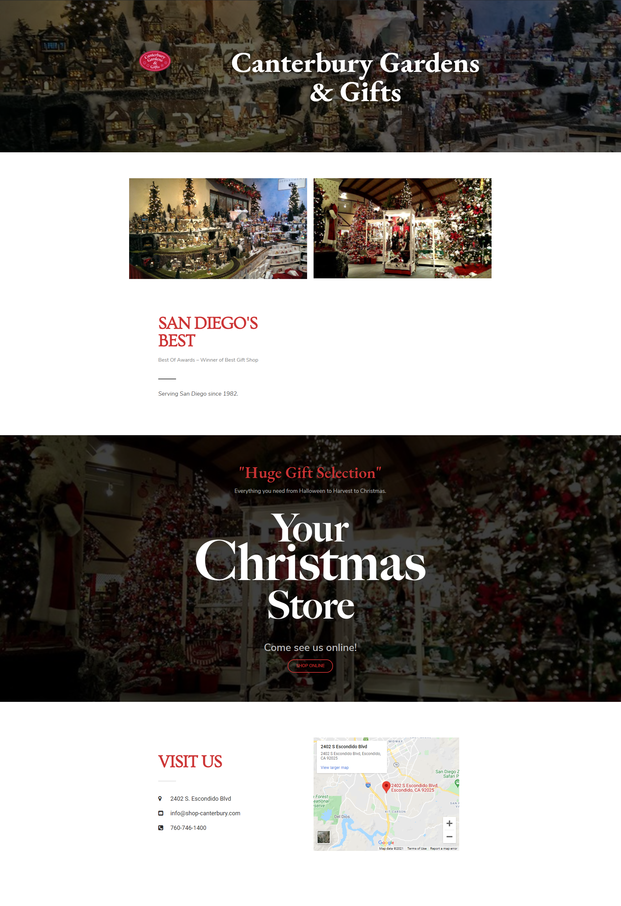

Canterbury Gardens was popular holiday gift shop in Escondido, California. I worked to manage and develop the brick-and-mortar store's local website and online eCommerce store, YourChristmasStore.  

I operated a database of 10,000+ SKUs, writing scripts in SQL, Python, and Microsoft Excel/VBA to automate backups and syncing inventories between the POS and website database. I migrated the site from Magento 1 to WordPress/WooCommerce, developing an new custom theme and doing technical and eCommerce SEO.

[yourchristmasstore.com](https://yourchristmasstore.com)

I designed the Escondido store's local website. 

[canterburygardens.com](https://canterburygardens.com)

I designed email marketing ads for local and online customers. I also designed YourChristmasStore's new logo, type set in modified Big Caslon. 

